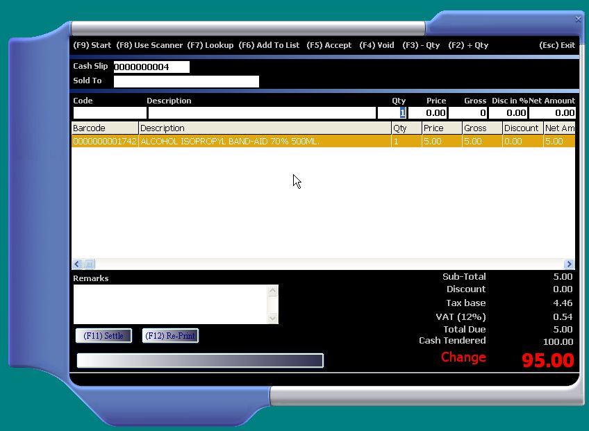



## A POS and Inventory System

### Description

POS and Inventory System v1.0

A must have features:

1. Barcode support

2. Point of Sales

3. Place an order (sales order or purchase order)

4. Receive or deliver an order by batch

More features and other files needed to run this source code can be found at www.sourcecodester.com

Revision:

Oct. 22, 2009

Made some changes on the header of the report rptCashInvoice.rpt to automatically retrieve the company info from Business Info table.
 
### More Info
 

             |
---                |---
**Submitted On**   |2009-08-31 11:20:50
**By**             |[jaypabs](https://github.com/Planet-Source-Code/PSCIndex/blob/master/ByAuthor/jaypabs.md)
**Level**          |Advanced
**User Rating**    |4.6 (55 globes from 12 users)
**Compatibility**  |VB 6\.0
**Category**       |[Complete Applications](https://github.com/Planet-Source-Code/PSCIndex/blob/master/ByCategory/complete-applications__1-27.md)
**World**          |[Visual Basic](https://github.com/Planet-Source-Code/PSCIndex/blob/master/ByWorld/visual-basic.md)
**Archive File**   |[A\_POS\_and\_21658810222009\.zip](https://github.com/Planet-Source-Code/jaypabs-a-pos-and-inventory-system__1-71315/archive/master.zip)

